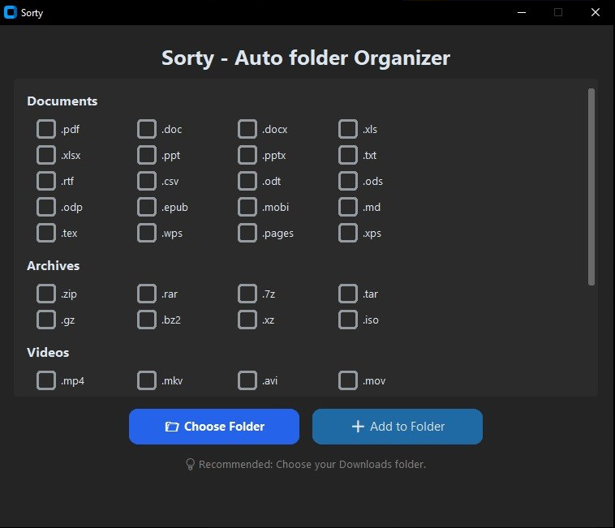
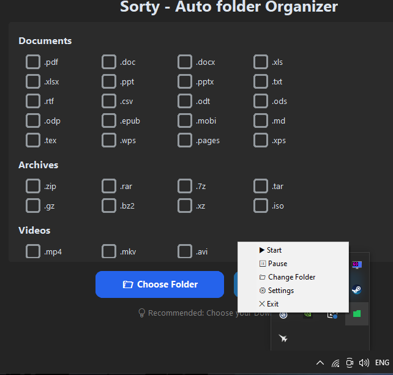

# 📂 Sorty

**Sorty - Auto Folder Organizer for Windows**

Sorty is a Windows application that automatically organizes files into folders based on their file extensions.

You choose a folder to monitor, select file extensions, and assign them to a folder. Sorty then runs in the background and periodically moves matching files into their configured folders.

---

## 📸 Screenshots

### Main Application



### System Tray




---

## ✨ Features

* 📁 Choose a folder to organize
* 🗂️ Create custom destination folders
* ☑️ Select multiple file extensions for one folder
* 📄 Organize documents
* 📦 Organize archives
* 🎬 Organize videos
* 🖼️ Organize images
* 🔄 Automatically check for new files
* ⏸️ Pause and resume the organizer
* 🖥️ Run in the Windows system tray
* 📁 Change the monitored folder from the tray
* ⚙️ Open the settings window from the tray
* 🚀 Automatically start with Windows when packaged as an `.exe`
* 💾 Store configuration in a JSON file

The application uses `pystray` and Pillow for its system-tray controls.

---

# 🧠 How It Works

Sorty monitors one selected folder.

For every configured rule, Sorty checks the files in that folder and moves files whose extensions match the rule.

For example, you can select:

```text
.jpg
.png
.jpeg
.webp
```

and create a destination folder called:

```text
Images
```

Sorty will then move matching image files into that folder.

## The organizer checks the folder approximately every **10 seconds**.

# 🚀 How to Use Sorty

## 1. Start Sorty

Launch the Sorty executable.

When Sorty is packaged as an `.exe`, it starts its background organizer and system tray application. The tray icon becomes the main control interface.

---

## 2. Choose a Folder

Open the Sorty tray menu and select:

```text
📁 Change Folder
```

Choose the folder you want Sorty to monitor.

For example:

```text
C:\Users\YourName\Downloads
```

Sorty saves the selected folder to its configuration.

The Downloads folder is a useful choice because downloaded files can automatically be moved into their appropriate folders.

---

## 3. Open Settings

From the system tray, select:

```text
⚙ Settings
```

This opens the Sorty configuration window.

---

## 4. Select File Extensions

The settings window displays the available extensions grouped into categories.

Currently supported categories are:

### 📄 Documents

```text
.pdf
.doc
.docx
.xls
.xlsx
.ppt
.pptx
.txt
.rtf
.csv
.odt
.ods
.odp
.epub
.mobi
.md
.tex
.wps
.pages
.xps
```

### 📦 Archives

```text
.zip
.rar
.7z
.tar
.gz
.bz2
.xz
.iso
```

### 🎬 Videos

```text
.mp4
.mkv
.avi
.mov
.wmv
.flv
.webm
.mpeg
.mpg
.3gp
.m4v
```

### 🖼️ Images

```text
.png
.jpg
.jpeg
.gif
.webp
.bmp
.tiff
.svg
.ico
.heic
```

These are the extension groups currently defined in the source code.

You can select **multiple extensions** at the same time.

For example:

```text
☑ .jpg
☑ .jpeg
☑ .png
☑ .webp
```

---

## 5. Add a Folder Rule

After selecting the extensions, click:

```text
➕ Add to Folder
```

Sorty asks you for a folder name.

For example:

```text
Images
```

The folder is created inside the folder being monitored.

The selected extensions are then associated with that destination folder.

---

## 6. Let Sorty Organize Your Files

Once the folder and rules are configured, Sorty runs in the background.

For example:

```text
Downloads/
│
├── photo.jpg
├── document.pdf
├── movie.mp4
└── archive.zip
```

With rules such as:

```text
Images     → .jpg .png .jpeg
Documents  → .pdf .docx .txt
Videos     → .mp4 .mkv
Archives   → .zip .rar .7z
```

Sorty moves matching files into their corresponding folders.

Result:

```text
Downloads/
│
├── Images/
│   └── photo.jpg
│
├── Documents/
│   └── document.pdf
│
├── Videos/
│   └── movie.mp4
│
└── Archives/
    └── archive.zip
```

---

# 🖥️ System Tray

Sorty is designed to run in the Windows system tray.

The tray menu provides:

```text
▶ Start
⏸ Pause
📁 Change Folder
⚙ Settings
✕ Exit
```

These controls are defined directly in the application source.

---

## ▶ Start

Starts or resumes automatic organization.

If the organizer has not already been started, Sorty starts its background organizer thread.

---

## ⏸ Pause

Pauses file moving.

When paused, Sorty leaves the files where they are until organization is resumed.

The tray icon changes to indicate the paused state.

---

## 📁 Change Folder

Allows you to choose a different folder for Sorty to monitor.

The new folder is saved to the configuration file.

---

## ⚙ Settings

Opens the Sorty configuration window where you can select extensions and add folder rules.

---

## ✕ Exit

Stops the tray application and exits Sorty.

The current implementation performs a complete process exit, including the background organizer thread.

---

# 🚀 Windows Startup

When Sorty is packaged as an executable, it creates a Windows Startup shortcut:

```text
Sorty.lnk
```

The shortcut is placed in the user's Windows Startup folder.

Sorty targets the actual packaged application executable rather than the Python source file.

This allows Sorty to start automatically when Windows starts.

---

# 💾 Configuration

Sorty stores its configuration in:

```text
%APPDATA%\Sorty\config.json
```

The configuration directory is created automatically if it does not already exist.

The configuration contains:

* The monitored folder
* The configured folder rules
* The extensions assigned to each rule

The configuration is saved as JSON.

A configuration can look like:

```json
{
  "folder": "C:\\Users\\YourName\\Downloads",
  "rules": {
    "Images": {
      "path": "C:\\Users\\YourName\\Downloads\\Images",
      "extensions": [
        ".jpg",
        ".png",
        ".jpeg"
      ]
    },
    "Documents": {
      "path": "C:\\Users\\YourName\\Downloads\\Documents",
      "extensions": [
        ".pdf",
        ".docx",
        ".txt"
      ]
    }
  }
}
```

---

# 🔄 Background Organization

The organizer runs on a background thread so the application can continue responding to tray controls.

Sorty prevents the organizer loop from being started more than once.

The organizer:

1. Checks whether it is paused.
2. Gets the configured folder.
3. Checks that the folder exists.
4. Reads the files in the folder.
5. Checks each configured rule.
6. Moves files whose extensions match.
7. Waits approximately 10 seconds.
8. Repeats.

---

# ⚠️ Duplicate Files

Sorty currently attempts to move a file to its destination using its original filename.

If a file with the same name already exists, the move operation is ignored rather than automatically renaming the file.

For example, if:

```text
Images/photo.jpg
```

already exists, another:

```text
photo.jpg
```

may not be moved.


---

# 🔒 Local File Organization

Sorty performs its file organization locally on the Windows computer.

The application reads files from the selected folder and moves matching files to their configured destination folders.

The source code does not implement an online server or cloud upload system.

---

# ⚠️ Important

Sorty **moves** files rather than making copies.

Before using it on an important folder, make sure your important files are backed up.

It is recommended to test Sorty with a temporary folder first.

---

# 🗺️ Current Application

The current version provides:

* Windows desktop application
* Custom folder selection
* Custom extension rules
* Multiple extensions per rule
* Documents, Archives, Videos, and Images extension groups
* Background organization
* 10-second organization interval
* Pause/resume
* System tray controls
* Windows Startup shortcut for packaged builds
* JSON configuration

---


# ⭐ Sorty

**Keep your folders organized automatically.**

📂 Choose your folder
☑ Select your extensions
➕ Create your folders
▶ Start Sorty
✨ Let Sorty handle the rest
